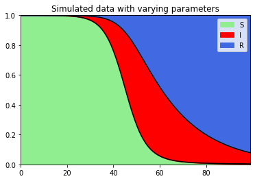

# BayesianSIR
Covid data analysis

<!--  -->

In this work we aim to recreate the results from the stochastic SIR model with change points, proposed in [this paper](https://www.nature.com/articles/s41598-022-25473-y#MOESM1). We are going to test it both on a simulated time series and on the epidemiological dataset from the Omicron wave of 2022 in Singapore. 

We start from the equations of the stochastic SIR model:

$$
\begin{cases}  \Delta I_t \sim \text{Binomial}(S_{t-1}, 1-exp(-\beta_tP_{t-1})) \\
  \Delta R_t \sim \text{Binomial}(I_{t-1}, \gamma_t) \\
  S_t = S_{t-1} - \Delta I_t \\
  I_t = I_{t-1} + \Delta I_t - \Delta R_t \\
  R_t = R_{t-1} + \Delta R_t \\
\end{cases}
$$

Where the transmission and removal rates $\beta = (\beta_1, ..., \beta_T), \gamma = (\gamma_1, ..., \gamma_T)$ depend on time. 
They are drawn from probability distributions whose characteristic parameters ($b$ or $r$) change as the epidemic enters a different stage. Thus, the *change points* correspond to a shift in the average transmission/removal rates. This is summarized in the vector 

$$\delta_t = 
\begin{cases}
1 \text{ if $t$ is a change point}\\
0 \text{ otherwise}
\end{cases} $$

We can then define $K:=\sum_t \delta_t$ and $\eta_t = \sum_{1, \dots, t}\delta_t$.

Starting from the time series $(\Delta I_t, \Delta R_t)_{t=1,...,T}$ with the initial conditions $(S_0,I_0,R_0)$, our goal is to infere $\delta, b,r, \beta, \gamma$.

The posterior probability is sampled through a Markov Chain Monte Carlo algorithm, in which a step $g$ looks like this:

#### 1. Propose a new $\delta$: delete, add or swap a $1$.
  In this first step, we propose a new $\delta^{\*}$ starting from the current one. The proposal is obtained by either **adding a transition** (i.e. adding a 1 in the $\delta$ vector), **removing a transition** (removing a 1 in the $\delta$ vector) or **swapping** two adjacent (and different) entries of $\delta$. If the vector is $[1, 0, 0, \dots, 0]$, we choose the **add** operation. Similarly, if the vector is $[1,1,1,\dots, 1]$, we choose the **remove** operation. In all other cases, the operation is chosen among these three with probability $[1/3, 1/3, 1/3]$.
  $\delta^{(g)} \rightarrow \delta^*$

#### 2. Accept $\delta^{(g+1)} = \delta^*$ with probability $p = \text{min}(1,\pi_{MH})$. If rejected, $\delta^{(g+1)} = \delta^{(g)}$. 
  The proposal is accepted with probability given by $m = \frac{\pi(\beta^{(g)}), \gamma^{(g)} | \delta^{\*})}{\pi(\beta^{(g)}, \gamma^{(g)}|\delta^{(g)})} \frac{\pi(\delta^\*)}{\pi(\delta^{(g)})}\frac{J(\delta^{(g)}|\delta^\*)}{J(\delta^\*|\delta^{(g)})}$. This ratio is computed in the following way:
   - $\frac{\pi(\delta^\*)}{\pi(\delta^{(g)})} = \left(\frac{p}{1-p}\right)^{\sum_t(\delta^\*_t-\delta^{(g)}_t)}$
   - $\pi(\beta^{(g)},\gamma^{(g)}|\delta) = \prod_{k} \left(\frac{0.1^{0.1}}{\Gamma(0.1)}\right)^2 \frac{\Gamma(0.1 + \sum_{t} \mathcal{1}(\eta_t = k))^2}{(\Gamma(0.1 + \sum_t \mathcal{1}(\eta_t = k)\beta_t)\cdot\Gamma(0.1 - \sum_t \mathcal{1}(\eta_t = k)\log\gamma_t))^{0.1 + \sum_t \mathcal{1}(\eta_t = k)}}$

Finally, the ratio $\frac{J(\delta^{(g)}|\delta^\*)}{J(\delta^\*|\delta^{(g)})}$ s is computed as

$$\frac{J(\delta^{(g)}|\delta^\*)}{J(\delta^\*|\delta^{(g)})} = \begin{cases}
1\text{ if }K^{(g)} = K_{proposed}\\
\frac{3}{T-1}\text{ if }(K_{proposed}, K^{(g)}) = (1,2)\text{ or }(T, T-1)\\
\frac{T-11}{3}\text{ if }(K_{proposed}, K^{(g)}) = (2,1)\text{ or }(T-1, T)\\
\frac{\sum \delta_t^{(g)} - 1}{T - \sum_t \delta}\text{ if }(K_{proposed}, K^{(g)}) = (2,3)\dots(T-2, T-1)\\
\frac{T - \sum_t \delta}{\sum_t \delta_t^{(g)} - 1}\text{ if }(K_{proposed}, K^{(g)}) = (3,2),\dots,(T-1,T-2)
   \end{cases}$$
   <!-- pi_MH = TODO  this formula is probably not correct, since our delta estimator cannot predict non-drastic change points-->   
#### 3a. update $b,r$.
   <!-- b,r ~ some Gamma function -->
#### 3b. update $\beta, \gamma$:
   
<!-- $$ y \sim Beta(\Delta I_t + 1, S_{t-1} - \Delta I_t - \frac{b^{(g+1)}_{\eta_t^{(g+1)}}}{P_{t-1}} + 1) $$  then $\beta_t^{(g+1)} = -\frac{log (y)}{P_{t-1}}$ and similarly, -->
Through some calculations, we find that 
$y  \sim \text{Beta}(S_{t-1} - \Delta I_t - b_{\eta_t}^{(g+1)}/P_{t-1} +1, \Delta I_t + 1)$,
from which $\beta_t^{(g+1)} = -\frac{log (y)}{P_{t-1}}$

Similarly, 
$\gamma_t \sim \text{Beta}(\Delta R_t+b_{\eta_t}^{(g+1)}, I_{t-1}-\Delta R_t+1)$. 
In both cases, the posterior is a combination of the likelihood of a binomial variable ($\Delta I_t$ or $\Delta R_t$) and its prior (an exponential distribution for $\beta$ and a Beta for $\gamma$).

#### 4. Naive estimators
The final estimate of $\beta, \gamma$ is the average of the sampled betas/gammas, which are compared with good results with the naive estimators. These are derived from the expected values of the binomial distributions for $\Delta I_t, \Delta R_t$:
<!-- beta-tilde is wrong in the paper! -->
```math 
\tilde{\beta_t} = -\frac{1}{P_{t-1}} log\Biggl(1-\frac{\Delta I_t}{S_{t-1}}\Biggr)
\qquad \tilde{\gamma} = \frac{\Delta R_t}{I_{t-1}}
```

#### 5. change-points prediction 
Finally, the set of $\delta^{(g)}$ obtained from the MC sampling is used to produce the Bayes estimator $\hat{\delta}$.

#### 6. Analysis
We compared results from a simulated dataset and the Singaporean Omicron wave with the analysis of the paper.
We found it difficult to retrieve less pronounced change points, whereas the model is quite good at predicting sharp stage transitions. This is the case of the real dataset. 

So overall the flowchart is 
  for g in range (G): <!-- after burnin, include thinning -->
    propose delta -> accept/refuse
    update change b,r,beta,gamma

  derive BayesEstimate for delta
  compare w paper result
    -> sharp transitions detected, smoother ones go under the radar
    


