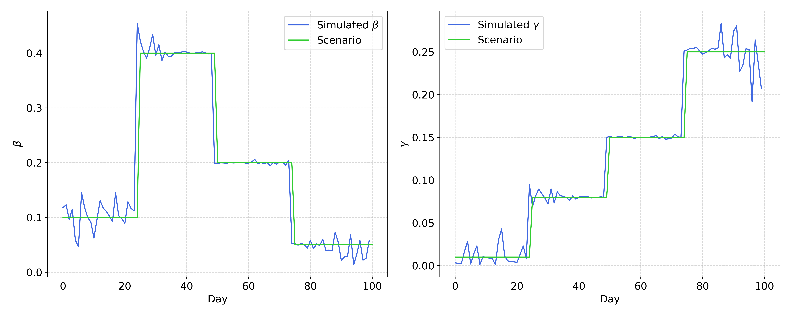
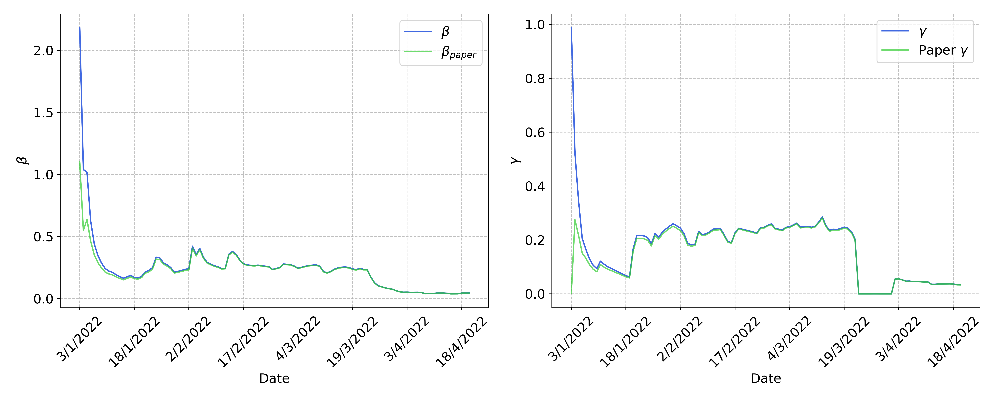

<h1 align="center">Information Theory and Inference - PoD  University of Padua   2023/2024</h1>

  
   
  

<h3 align="center"><b>Group members:</b> A. Feltrin, G. Sardo Infirri, R. Tancredi, S. Toso </h3>

# Bayesian SIR: Covid data analysis

In this work we aim to recreate the results from the stochastic SIR model with change points, proposed in the [Gu & Yin paper (2022)](https://www.nature.com/articles/s41598-022-25473-y#MOESM1). We tested it both on a simulated time series and on the epidemiological dataset from the `Omicron` wave of 2022 in Singapore. 

The starting point is given by the equations of the **stochastic SIR model**:

$$
\begin{cases}  \Delta I_t \sim \text{Binomial}(S_{t-1}, 1-\exp(-\beta_tP_{t-1})) \\
  \Delta R_t \sim \text{Binomial}(I_{t-1}, \gamma_t) \\
  S_t = S_{t-1} - \Delta I_t \\
  I_t = I_{t-1} + \Delta I_t - \Delta R_t \\
  R_t = R_{t-1} + \Delta R_t \\
\end{cases}
$$

Where the transmission and removal rates $\beta = (\beta_1, ..., \beta_T), \gamma = (\gamma_1, ..., \gamma_T)$ depend on time. 
They are drawn from probability distributions whose characteristic parameters ($b$ and $r$ respectively) change as the epidemic enters into different stages. Thus, *change points* correspond to a shift in the average transmission/removal rates. This is summarized in the vector 

$$\delta_t = 
\begin{cases}
1 \quad \text{ if $t$ is a change point}\\
0 \quad \text{ otherwise}
\end{cases} $$

It is possible then to define $K:=\displaystyle\sum_{t=1}^T \delta_t$ and $\eta_t = \displaystyle\sum_{u=1}^t\delta_u^{(t)}$.

Starting from the time series $(\Delta I_t, \Delta R_t)\big\vert_{t=1,...,T}$ with initial conditions $(S_0,I_0,R_0)$, the goal is to correctly infere $\delta, b,r, \beta, \gamma$.

The posterior probability is sampled through a **Markov Chain Monte Carlo** algorithm, in which a step $g$ is computed following a **Gibbs sampling** procedure:

#### 1. Propose a new $\delta$: delete, add or swap a $1$.
  As first step, we propose a new $\delta^{\star}$ starting from the current one. The proposal is obtained by either **adding a transition** (i.e. adding a 1 in the $\delta$ vector), **removing a transition** (removing a 1 in the $\delta$ vector) or **swapping** two adjacent (and different) entries of $\delta$. If the vector is $[1, 0, 0, \dots, 0]$, we choose the **add** operation. Similarly, if the vector is $[1,1,1,\dots, 1]$, we choose the **remove** operation. In all other cases, the operation is chosen among these three with uniform probability $[1/3, 1/3, 1/3]$.
  $$\delta^{(g)} \rightarrow \delta^\star$$

#### 2. Accept $\delta^{(g+1)} = \delta^\star$ with probability $p = \text{min}(1, m_{MH})$. If rejected, $\delta^{(g+1)} = \delta^{(g)}$. 
  The proposal is accepted with probability given by $$m_{MH} = \min\biggl(1, \:\frac{\pi(\beta^{(g)}, \gamma^{(g)} \big\vert \delta^{\star})}{\pi(\beta^{(g)}, \gamma^{(g)}\big\vert\delta^{(g)})} \frac{\pi(\delta^\star)}{\pi(\delta^{(g)})}\frac{J(\delta^{(g)}\big\vert\delta^\star)}{J(\delta^\star\big\vert\delta^{(g)})}\biggr).$$ 
  This ratio is computed in the following way:
   - $$\frac{\pi(\delta^\star)}{\pi(\delta^{(g)})} = \left(\frac{p}{1-p}\right)^{\sum_t(\delta^\star_t-\delta^{(g)}_t)}$$
   - $$\pi(\beta^{(g)},\gamma^{(g)}\big\vert\delta) = \prod_{k} \left(\frac{0.1^{0.1}}{\Gamma(0.1)}\right)^2 \frac{\Gamma(0.1 + \sum_{t} \mathcal{1}(\eta_t = k))^2}{(\Gamma(0.1 + \sum_t \mathcal{1}(\eta_t = k)\beta_t)\cdot\Gamma(0.1 - \sum_t \mathcal{1}(\eta_t = k)\log\gamma_t))^{0.1 + \sum_t \mathcal{1}(\eta_t = k)}}$$

Finally, the ratio $\frac{J(\delta^{(g)}\big\vert\delta^\star)}{J(\delta^\star\big\vert\delta^{(g)})}$ is computed as:

$$ \frac{J(\delta^{(g)}\big\vert\delta^\star)}{J(\delta^\star\big\vert\delta^{(g)})} = 
   \begin{cases}
      \frac{\sum_t \mathbb{I}(\delta^{(g),t} \neq \delta^{(g), t+1})}{\sum_t \mathbb{I}(\delta^{\star,t} \neq \delta^{\star,t+1})} \quad \text{ if }K^{(g)} = K_{proposed}\\
      \frac{3}{T-1} \quad \text{ if }(K_{proposed}, K^{(g)}) = (1,2) \text{ or }(T, T-1)\\
      \frac{T-1}{3} \quad \text{ if }(K_{proposed}, K^{(g)}) = (2,1)\text{ or }(T-1, T)\\
      \frac{\sum \delta_t^{(g)} - 1}{T - \sum_t \delta} \quad \text{ if }(K_{proposed}, K^{(g)}) = (2,3)\dots(T-2, T-1)\\
      \frac{T - \sum_t \delta}{\sum_t \delta_t^{(g)} - 1} \quad \text{ if }(K_{proposed}, K^{(g)}) = (3,2),\dots,(T-1,T-2)
  \end{cases}$$

   <!-- pi_MH = TODO  this formula is probably not correct, since our delta estimator cannot predict non-drastic change points-->   
#### 3a. Update $b,r$.
Once we have sampled the new $\delta^{\star}$, we get a new $\eta^\star$ and $K^\star$ according to the definitions above. We then sample $b$ and $r$ as 

$$b_k \sim\text{Gamma}(0.1 + \sum_{t} \mathbb{I}(\eta_t = k), 0.1 + \sum_t \beta_t \mathbb{I}(\eta_t = k))$$
and

$$r_k \sim\text{Gamma}(0.1 + \sum_{t}\mathbb{I}(\eta_t = k), 0.1 - \sum_t \log{\gamma_t})\mathbb{I}(\eta_t = k)$$
   <!-- b,r ~ some Gamma function -->
#### 3b. Update $\beta, \gamma$:
   Finally, the parameters $\beta$ and $\gamma$ can be updated. 

   $\beta$ is sampled from its posterior distribution:

  $$\beta \sim (1-\exp(-\beta_t P_{t-1}))^{\Delta I_T}\exp(-\beta_t P_{t-1}(S_{t-1} - \Delta T_t))\pi(\beta_t\big\vert b^{(g+1)}_{\eta_t^{(g+1)}}) $$

  To do this efficiently, we apply the change of variable $y := e^{-\beta_t P_{t-1} }$ and get that 

  $$y \sim \text{Beta}(A/C, D+1)$$

  with $C = P_{t-1}$, $D = \Delta I_{t-1}$ and $A = -\beta_t P_{t-1}(S_{t-1} -\Delta I_t + b)$
  
<!-- $$ y \sim Beta(\Delta I_t + 1, S_{t-1} - \Delta I_t - \frac{b^{(g+1)}_{\eta_t^{(g+1)}}}{P_{t-1}} + 1) $$  then $\beta_t^{(g+1)} = -\frac{log (y)}{P_{t-1}}$ and similarly, -->

Therefore, we can sample $y$ from the beta distribution and get $\beta_t^{(g+1)} = -\frac{log (y)}{P_{t-1}}$.

Similarly, 

$$\gamma_t \sim \gamma_t^{\Delta R_t}(1-\gamma_t)^{I_{t-1}-\Delta R_t}\pi(\gamma_t\big\vert r^{(g+1)}_{\eta_t^{(g+1)}})$$

which can be easily sample from 

$$\gamma_t \sim \text{Beta}(\Delta R_t+r_{\eta_t}^{(g+1)}, I_{t-1}-\Delta R_t+1).$$

In both cases, the posterior is a combination of the likelihood of a binomial variable ($\Delta I_t$ or $\Delta R_t$) and its prior an exponential distribution for $\beta$ and a Beta for $\gamma$ respectively.

#### 4. Change-points prediction 
Finally, the set of $\delta^{(g)}$ obtained from the MC sampling is used to produce the Bayes estimator $\hat{\delta}$. Interpreting each $\delta^{(g)}$ as a cluster of time points $1, \dots, T$, $\hat{\delta}$ is obtained solving a clustering aggregation problem. 

First, one computes the matrix $\hat{Q}$ whose entries are: $$\hat{q}_{tt'}=\frac{1}{G}\displaystyle\sum_{g=1}^G \mathbb{I}(\eta_t^{(g)}= \eta_{t'}^{(g)})$$ representing the posterior probability that no change point exists in the interval $\{t+1, \dots t'\}$, with of course $1\leq t < t' \leq T$.

Then, $\hat{\delta}$ is the one minimizing the following loss: $$\hat{\delta} = \underset{\delta}{\text{argmin}} \displaystyle\sum_{1\leq t < t' \leq T} \big\vert \mathbb{I}(\eta_t = \eta_{t'}) - \hat{q}_{tt'} \big\vert$$

#### 5. Simulated data

To evaluate performances of the explained method, we have simulated the Bayesian SIR model sampling $\Delta I$ and $\Delta R$ from the corresponding binomial distributions and then computing the three variables $S,\:I,\:R$. Below we present a $\texttt{Scenario}$ similar to the one proposed in the studied paper, having set as initial conditions $$N=10^6,\: I_0=50\: \text{and}\: T=100\:\text{days}.$$  

  

In the below plot the simulated $\beta$'s and $\gamma$'s are compared with those imposed at the start of the simulation

  

The plot below shows the $\delta$ change points in the run simulation $\texttt{Scenario}$. Two out of three transitions are correctly recovered, leading to a good values of $MI$ and $ARI$ indexes.  

  

#### 6. Mutual Information and Adjusted Rand Index

Changing the probability $p$ characterizing $\delta$'s vectors we have evaluated the change in the Mutual Information ($MI$) and the Adjusted Rand Index ($ARI$) measures. 

|  $p$ 	|  $ARI$ 	|  $MI$ 	|
|:----:	|:-----:	|-------	|
| 0.01 	| 0.663 	| 0.955 	|
| 0.05 	| 0.632 	| 0.920 	|
| 0.2  	| 0.663 	| 0.955 	|

#### 7.a Naive estimators

The final estimate of $\beta$ ($\gamma$) is the average of the sampled betas (gammas), which are compared with good results with the naive estimators. These are derived from the expected values of the binomial distributions for $\Delta I_t, \Delta R_t$:
<!-- beta-tilde is wrong in the paper! -->

$$\tilde{\beta_t} = -\frac{1}{P_{t-1}} log\Biggl(1-\frac{\Delta I_t}{S_{t-1}}\Biggr)
\qquad \tilde{\gamma} = \frac{\Delta R_t}{I_{t-1}}$$

#### 7.b Analysis

Even in this case, there is very good agreement between the simulated and the expected results: it was difficult to retrieve less pronounced change points, whereas the model is quite good at predicting sharp stage transitions. The numbers of daily confirmed and removed COVID-19 cases is here presented:

  

$\beta$ and $\gamma$ are very well fitted, using the procedure afore explained, exception made for the starting points.

  

In our code, $\delta$ meets precisely the updating conditions described, but unfortunately we have not been able to reproduce all the four *change points*, but just two of them:

  

As one can see by the above plot with $\beta$ the *transmission rate* is very high during the first several days of pandemic, then decreasing almost to zero. Instead, the $\gamma$ plot emphasizes how the *removal rate* has two drops at the $\delta$ change points:

  

#### 8. Conclusion

Overall, we have been able to reproduce many of the results shown and to correct some mistakes made by the cited authors. Still some investigations must be carried out in order to understand with $\delta_t^{(g)}$ does not show the same behaviour presented in the paper, but only two of the main *change points*.
